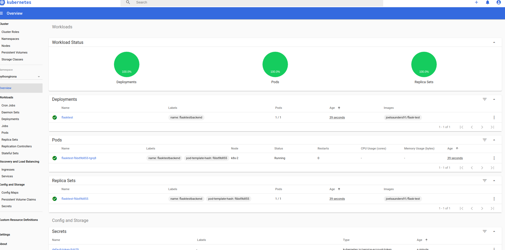
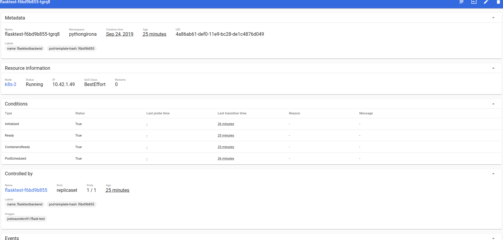
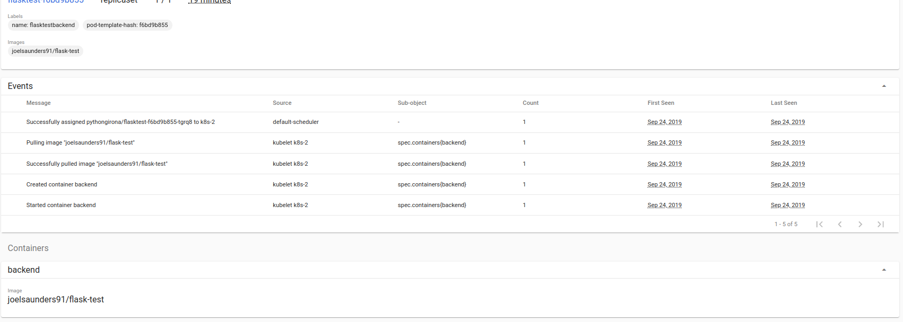
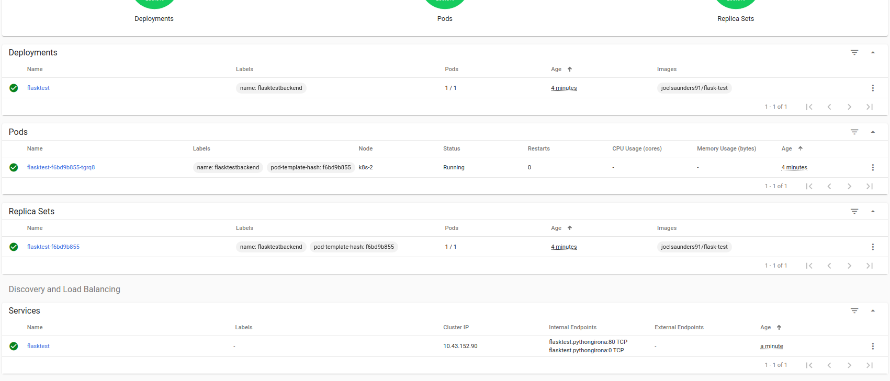
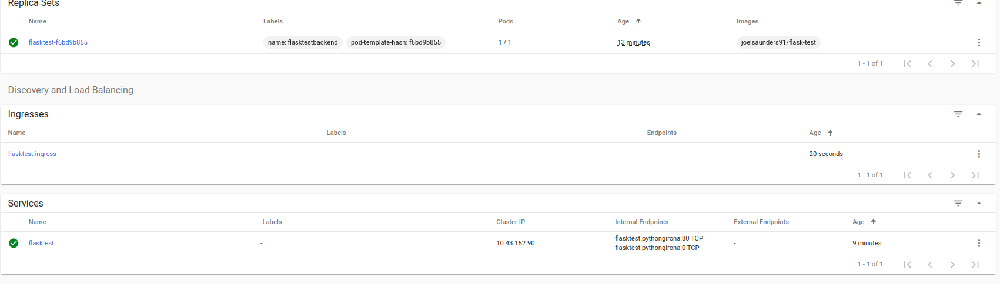

## Create the namespace
```bash
$ kubectl create namespace pythongirona
namespace/pythongirona created
```


## Create the deployment

Create flasktest `deployment` with:
```bash
$ kubectl apply -f demo/deployment.yaml 
deployment.extensions/flasktest created
```



### POD detail




## Create the service

Create flasktest `service` with:
```bash
$ kubectl apply -f demo/service.yaml 
service/flasktest created
```


Now our `deployment` is "grouped" and accessible over this new `service`, and the `service` uses the **local** IP `10.43.152.90`.

So, from our cluster it can reached it with:
```bash
rolf@k8s-2:~$ curl 10.43.152.90
Hello World!
```


## Create the ingress

Create flasktest `ingress` with:
```
$ kubectl apply -f demo/ingress.yaml 
ingress.extensions/flasktest-ingress created
```



Now our `service` is exposed using `hello.env.pythongirona.cat`, so from internet it's reachable:
```bash
$ curl hello.env.pythongirona.cat
Hello World! 
```